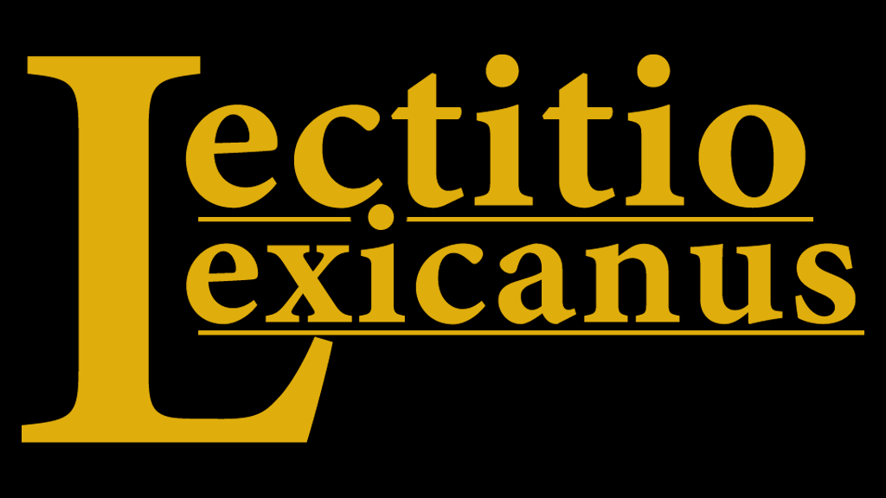

<!-- Improved compatibility of back to top link: See: https://github.com/othneildrew/Best-README-Template/pull/73 -->
<a name="readme-top"></a>
<!--
*** Thanks for checking out the Best-README-Template. If you have a suggestion
*** that would make this better, please fork the repo and create a pull request
*** or simply open an issue with the tag "enhancement".
*** Don't forget to give the project a star!
*** Thanks again! Now go create something AMAZING! :D
-->


<!-- PROJECT SHIELDS -->
<!--
*** I'm using markdown "reference style" links for readability.
*** Reference links are enclosed in brackets [ ] instead of parentheses ( ).
*** See the bottom of this document for the declaration of the reference variables
*** for contributors-url, forks-url, etc. This is an optional, concise syntax you may use.
*** https://www.markdownguide.org/basic-syntax/#reference-style-links
-->
[![Contributors][contributors-shield]][contributors-url]
[![Forks][forks-shield]][forks-url]
[![Stargazers][stars-shield]][stars-url]
[![Issues][issues-shield]][issues-url]
[![MIT License][license-shield]][license-url]


<!-- PROJECT LOGO -->
<br />
<div align="center">
  <a href="https://github.com/JCalebBR/LectitioLexicanus">
    
  </a>

  <p align="center">
    A Lexicanum-based dictionary for Kindles.
    <br />
    ·
    <a href="https://github.com/JCalebBR/LectitioLexicanus/issues">Report Bug</a>
    ·
    <a href="https://github.com/JCalebBR/LectitioLexicanus/issues">Request Feature</a>
  </p>
</div>


<!-- TABLE OF CONTENTS -->
<details>
  <summary>Table of Contents</summary>
  <ol>
    <li>
      <a href="#about-the-project">About The Project</a>
      <ul>
        <li><a href="#built-with">Built With</a></li>
      </ul>
    </li>
    <li>
      <a href="#getting-started">Getting Started</a>
      <ul>
        <li><a href="#prerequisites">Prerequisites</a></li>
        <li><a href="#installation">Installation</a></li>
      </ul>
    </li>
    <li><a href="#roadmap">Roadmap</a></li>
    <li><a href="#contributing">Contributing</a></li>
    <li><a href="#license">License</a></li>
    <li><a href="#acknowledgments">Acknowledgments</a></li>
  </ol>
</details>


<!-- ABOUT THE PROJECT -->
## About The Project


<br />
<br />
This project is a dictionary for the Warhammer 40k universe, based on the Lexicanum website. It is intended to be used on Kindles, but can be used on any device that supports MOBI files.

<p align="right">(<a href="#readme-top">back to top</a>)</p>


### Built With

* [![Python]][Python-url]

<p align="right">(<a href="#readme-top">back to top</a>)</p>


<!-- GETTING STARTED -->
## Getting Started

If you are simply interested in using the dictionary, you can download the latest release [here]([releases-url])

### Prerequisites

This is an example of how to list things you need to use the software and how to install them.
* pip
  ```sh
  pip install requests tqdm json re
  ```

### Installation

1. Clone the repo
   ```sh
   git clone https://github.com/JCalebBR/LectitioLexicanus.git
   ```
2. Run `lexicanum.py` to obtain the latest version of the Lexicanum Dump.
   
   **Note that this will take a while due to the large size of the Lexicanum website and how data is obtained.**
    ```sh	
    python lexicanum.py
    ```

3. Run `filter.py` to filter results. This will create a file called `filtered-output.jsonl` which will be used to create the dictionary.
    ```sh	
    python filter.py
    ```

4. Run `dict.py` to create the dictionary. This will create a file called `content.html` in the `dict` directory, which will be the contents of the dictionary.
    ```sh	
    python dict.py
    ```

5. Run `kindlegen.exe` to create the MOBI file. This will create a file called `dict.mobi` in the `dict` directory, which will be the dictionary.
    ```sh	
    kindlegen.exe dict/dict.opf -c2 -verbose -dont_append_source
    ```


<p align="right">(<a href="#readme-top">back to top</a>)</p>


<!-- ROADMAP -->
## Roadmap

- [ ] Reduce number of entries by associating entries with a parent entry. For example, "Theron (Planet)" and "Theron (Squad)" could be associated with "Theron (Ultramarines)".
- [ ] Add better formatting to the dictionary entries.

See the [open issues](https://github.com/JCalebBR/LectitioLexicanus/issues) for a full list of proposed features (and known issues).

<p align="right">(<a href="#readme-top">back to top</a>)</p>


<!-- CONTRIBUTING -->
## Contributing

Contributions are what make the open source community such an amazing place to learn, inspire, and create. Any contributions you make are **greatly appreciated**.

If you have a suggestion that would make this better, please fork the repo and create a pull request. You can also simply open an issue with the tag "enhancement".
Don't forget to give the project a star! Thanks again!

1. Fork the Project
2. Create your Feature Branch (`git checkout -b feature/AmazingFeature`)
3. Commit your Changes (`git commit -m 'Add some AmazingFeature'`)
4. Push to the Branch (`git push origin feature/AmazingFeature`)
5. Open a Pull Request

<p align="right">(<a href="#readme-top">back to top</a>)</p>


<!-- LICENSE -->
## License

Distributed under the MIT License. See `LICENSE.txt` for more information.

<p align="right">(<a href="#readme-top">back to top</a>)</p>


<!-- ACKNOWLEDGMENTS -->
## Acknowledgments

* [Jake McCrary](https://jakemccrary.com) - For his insightful documentation on creating a Kindle dictionary.
* [Games Workshop and The Black Library](https://www.blacklibrary.com/) - For creating the Warhammer 40k universe.
  
<p align="right">(<a href="#readme-top">back to top</a>)</p>


<!-- MARKDOWN LINKS & IMAGES -->
<!-- https://www.markdownguide.org/basic-syntax/#reference-style-links -->
[contributors-shield]: https://img.shields.io/github/contributors/JCalebBR/LectitioLexicanus.svg?style=for-the-badge
[contributors-url]: https://github.com/JCalebBR/LectitioLexicanus/graphs/contributors
[forks-shield]: https://img.shields.io/github/forks/JCalebBR/LectitioLexicanus.svg?style=for-the-badge
[forks-url]: https://github.com/JCalebBR/LectitioLexicanus/network/members
[stars-shield]: https://img.shields.io/github/stars/JCalebBR/LectitioLexicanus.svg?style=for-the-badge
[stars-url]: https://github.com/JCalebBR/LectitioLexicanus/stargazers
[issues-shield]: https://img.shields.io/github/issues/JCalebBR/LectitioLexicanus.svg?style=for-the-badge
[issues-url]: https://github.com/JCalebBR/LectitioLexicanus/issues
[license-shield]: https://img.shields.io/github/license/JCalebBR/LectitioLexicanus.svg?style=for-the-badge
[license-url]: https://github.com/JCalebBR/LectitioLexicanus/blob/master/LICENSE.txt
[product-screenshot]: images/screenshot.png
[example-01]: images/example-01.png
[example-02]: images/example-02.png
[example-03]: images/example-03.png
[example-04]: images/example-04.png
[releases-url]: https://github.com/JCalebBR/releases
[Python]: https://img.shields.io/badge/python-000000?style=for-the-badge&logo=python
[Python-url]: https://www.python.org/